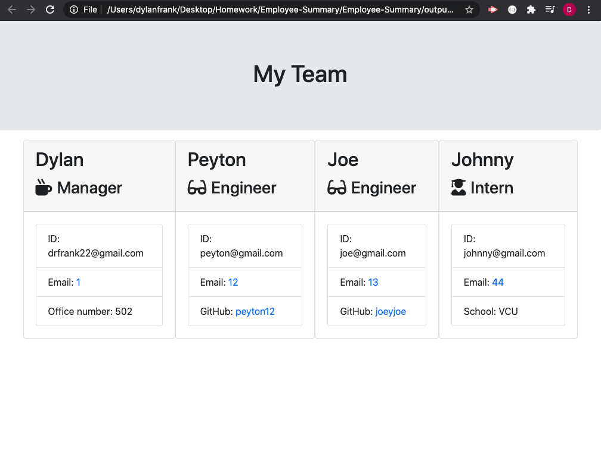

# Employee Summary

## Description

This project is a Command Line Interface (CLI) and allows a way for you to create an employee summary for your business. It will add in the manager for a team, as well as adding in engineers and interns for the manager. Future development for this app would allow for multiple managers, positions and roles to be updated and deleted as well. It also outputs an html document (if none exists already) with the information provided.

## Table of Contents 

* [Installation](#installation)

* [Usage](#usage)

* [License](#license)

* [Contributing](#contributing)

* [Tests](#tests)

* [Questions](#questions)

## Installation

To install necessary dependencies, run the following command:

`
npm i
`

## Usage

You will need to run the install and then run `npm start` in the command line to initiate the app.

## License

This project is licensed under GPL-3.0.
  
## Contributing

Anyone and Everyone

## Tests

To run tests, run the following command:

`
npm test
`

## Questions

If you have any questions about the repo,please contact me at drfrank22@gmail.com.

## Demo

<a href="https://www.youtube.com/watch?v=ubtm43GavPA&feature=youtu.be">Check out a demo here</a>
